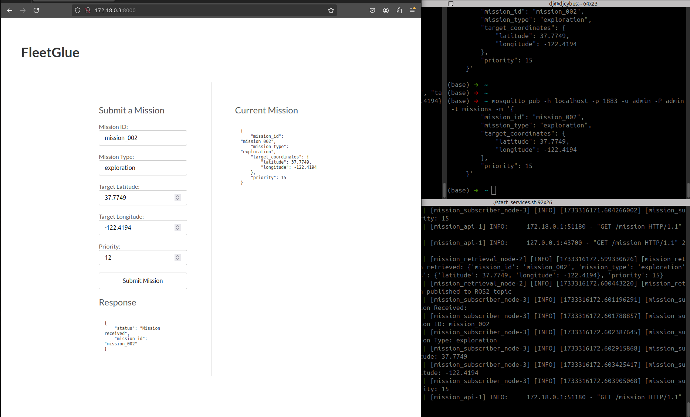
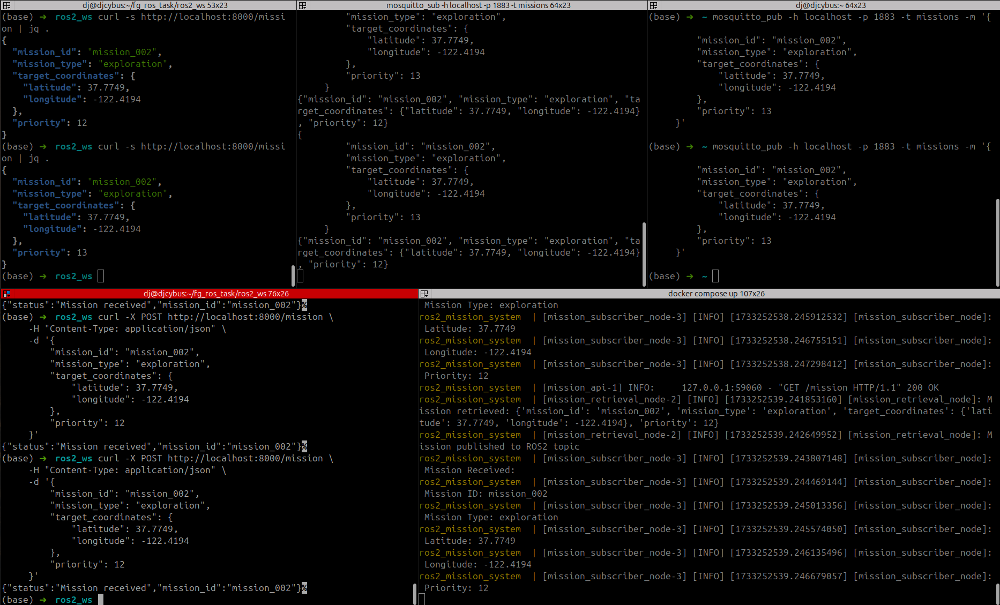

# fleetG ROS2 task

fleetG ROS2 mission communication application. It creates a python REST API, which has POST and GET mission endpoints. ROS2 node, RN1 gets mission from the REST API URL in JSON and sends it to the Action Server. RN2, the action server simply executes a callback to display the ROS actions. REST API POST/GET and MQTT JSON PUB/SUB is interchangeable in this project. 

It also starts Gazebo with a simulated robot whose movement can be controlled by MQTT payload or through a browser by, http://localhost:8000.




## Table of Contents
- [fleetG ROS2 task](#fleetg-ros2-task)
  - [Table of Contents](#table-of-contents)
  - [Overview](#overview)
  - [Features](#features)
  - [Prerequisites](#prerequisites)
  - [Installation](#installation)
    - [1. Clone the Repository](#1-clone-the-repository)
  - [Build the Docker Image](#build-the-docker-image)
    - [Build the Docker image using Docker Compose:](#build-the-docker-image-using-docker-compose)
  - [Project Structure](#project-structure)
- [Usage](#usage)
    - [Running the Application](#running-the-application)
      - [Ensure you have .env file in the current folder as:](#ensure-you-have-env-file-in-the-current-folder-as)
      - [Run start\_services.sh script:](#run-start_servicessh-script)
      - [Run start\_services.sh (in progress)](#run-start_servicessh-in-progress)
    - [MQTT](#mqtt)
- [This is taken care of when you run the application using start\_services.sh script, yet if you run into problems ensure you have MQTT installed and running](#this-is-taken-care-of-when-you-run-the-application-using-start_servicessh-script-yet-if-you-run-into-problems-ensure-you-have-mqtt-installed-and-running)
- [Testing](#testing)
- [Troubleshooting](#troubleshooting)
    - [Common Issues](#common-issues)
      - [Want to contribute?](#want-to-contribute)
    - [TODO](#todo)
      - [Maintainer:](#maintainer)

## Overview

The FleetG Mission Management System is designed to facilitate mission management for fleets of autonomous systems. It leverages ROS2 (Humble Hawksbill) and includes:

- A FastAPI REST API for mission submission and retrieval.
- ROS2 nodes for mission retrieval and subscription.
- Dockerization for easy deployment using Docker and Docker Compose.

## Features

- **REST API**: Submit and retrieve missions via HTTP requests.
- **ROS2 Integration**: Nodes communicate using ROS2 topics.
- **Dockerized Deployment**: Easily build and run the application in a containerized environment.
- **Scalable Architecture**: Modular design allows for easy extension and integration with other systems.

## Prerequisites

Before you begin, ensure you have the following software installed on your system:

- Docker (version 20.10 or later)
- Docker Compose (version 1.29 or later)
- Git (optional, for cloning the repository)

## Installation

### 1. Clone the Repository

```bash
git clone https://github.com/yourusername/fleetg_ros2.git
cd fleetg_ros2

```

## Project Structure

Here's an overview of the project structure:
```bash
fleetg_ros2/
├── Dockerfile
├── docker-compose.yml
├── docker-entrypoint.sh
├── pyproject.toml
├── poetry.lock
├── templates/
    └──index.html
├── README.md
└── src/
    └── fg_srv/
        ├── fg_srv/
        │   ├── __init__.py
        │   ├── rn1.py
        │   └── rn2.py
        ├── action/
        │   ├── Mission.action
        ├── urdf/
        │   ├── mission_robot.urdf
        ├── worlds/
        │   ├── empty.worlds
        ├── rest_api/
        │   ├── __init__.py
        │   └── app.py
        ├── resource/
        │   └── fg_srv
        ├── package.xml
        ├── setup.py
        └── launch/
            └── mission_system.launch.py

```

- Dockerfile: Defines the Docker image configuration.
- docker-compose.yml: Defines services, networks, and volumes for Docker Compose.
- docker-entrypoint.sh: Entrypoint script that launches the ROS2 nodes.
- pyproject.toml and poetry.lock: Python project configuration files managed by Poetry.
- src/fg_srv/: ROS2 package containing the source code.

# Usage
### Running the Application

#### Ensure you have .env file in the current folder as:

```bash
# .env
ROS_DOMAIN_ID=42
MQTT_BROKER_HOST=mqtt_broker
MQTT_BROKER_PORT=1883
MQTT_USERNAME=admin
MQTT_PASSWORD=admin
ROS_DISTRO=humble
HOST_IP=127.0.0.1 #Default! -override in start_services.sh
```

## Docker Image

### Build the Docker image using Docker Compose:
```bash
docker build --no-cache -t debug-context .

```

#### Run start_services.sh script:
```bash
chmod +x start_services.sh
./start_services.sh
```

#### Run start_services.sh (in progress)
```bash
chmod +x start_services.sh
./start_services.sh test
```
### Go to below link or the container IP shown in the logs
```bash
http://localhost:8000/

```
This command ensures the MQTT broker is not already running in background and then starts the Docker container, and the application begins running the ROS2 nodes.
Interacting with the REST API


The REST API listens on port 8000. You can interact with it using curl or any HTTP client.
1. Submit a Mission

To submit a mission, send a POST request:
```bash
curl -X POST http://localhost:8000/mission \
     -H "Content-Type: application/json" \
     -d '{
         "mission_id": "mission_001",
         "mission_type": "exploration",
         "target_coordinates": {
             "latitude": 37.7749,
             "longitude": -122.4194
         },
         "priority": 2
     }'
```
2. Retrieve the Current Mission

To retrieve the current mission, send a GET request:
```bash
curl http://localhost:8000/mission
```
3. Expected Responses

    Successful Submission (HTTP 200):
```bash
{
  "status": "Mission received",
  "mission_id": "mission_001"
}
```

Retrieve Mission (HTTP 200):
```bash
    {
      "mission_id": "mission_001",
      "mission_type": "exploration",
      "target_coordinates": {
        "latitude": 37.7749,
        "longitude": -122.4194
      },
      "priority": 2
    }
```

### MQTT
If your want to test MQTT API, you can install mosquitto-clients and start the mosquitto service to send and receive ROS2 messages.
```bash
sudo apt-get update && sudo apt-get install -y mosquitto-clients
sudo systemctl status mosquitto

# if the service is not running
sudo systemctl start mosquitto
```

** MQTT for ROS2 applicatoin is already configured and running in Docker container

#### Subscribe to the mission topic
```bash
mosquitto_sub -h localhost -p 1883 -u admin -P 'admin' -t missions
```
#### Publish to the mission topic
```bash
mosquitto_pub -h localhost -p 1883 -u admin -P 'admin' -t missions -m '{"mission_id": "mission_001", "mission_type": "delivery", "target_coordinates": {"latitude": 52.5200, "longitude": 13.4050}, "priority": 1}'
```
Username and Password is set using .env file.

# Testing

You can test the ROS2 nodes and API functionality by following the usage instructions. Additionally, you can:

- Check ROS2 Topics: List ROS2 topics inside the container.
  
```bash
docker exec -it fleetg_ros2-ros2_mission_system-1 /bin/bash
source /opt/ros/humble/setup.bash
source /app/install/setup.bash
ros2 topic list
```

- Monitor Node Logs: View logs to debug any issues.

```bash
    docker logs fleetg_ros2-ros2_mission_system-1
```

# Troubleshooting
### Common Issues
1. Port Already in Use
   - Symptom: Error indicating that port 8000 is already in use.
   - Solution: Stop any service using port 8000 or change the exposed port in docker-compose.yml.
   - Check if the 1883 is busy:
     - #### sudo lsof -i :1883
     - #### sudo systemctl stop mosquitto - ubuntu
     - #### sudo kill -9 <PID> -ubuntu
     - #### brew services stop mosquitto - MacOS

2. Docker Build Fails

   - Symptom: Errors during the Docker image build process.
   - Solution:
     - Ensure all files are correctly placed and have the proper permissions.
     - Check for syntax errors in setup.py, package.xml, and other configuration files.
     - Verify that all dependencies are correctly specified.

3. Cannot Find Executable

   - Symptom: Error stating that an executable is not found in the expected directory.
   - Solution:
     - Ensure that the setup.py file correctly specifies the packages and entry points.
     - Rebuild the Docker image to incorporate any changes.
     - 
4. MQTT connection refused for both pub/sub
      -  mosquitto_sub -h localhost -p 1883 -u admin -P 'admin' -t missions
      -  error: Connection refused
      -  **Solution:** 
      -  sudo systemctl start mosquitto
      -  sudo systemctl enable mosquitto
  
  


#### Want to contribute? 
  - Fork the Repository: Create your own fork of the project.
  - Create a Feature Branch: Work on your feature or bug fix in a new branch.
  - Commit Your Changes: Make sure your commits are clear and descriptive.
  - Open a Pull Request: Submit your changes for review.


### TODO
- Add comprehensive test
- Move to ROS2 Jazzy
- Move restAPI url to .env
- Embed MQTT broker inside the docker
- Add reverse proxy using NGINX
- Deploy using AWS cloudformation

#### Maintainer:
Diwaker 
# testros
